# RWX Baker • Arknights: Endfield Message Generator/Dialogue Maker

> **An in-browser recreation and message generator for *Arknights: Endfield* "Baker" messaging app.**

[](https://baker.rwyn.ch/)
[](LICENSE)
[](privacy.html)
[](privacy.html)
[](notice.html)

First and foremost, GLORY TO HYPERGRYPH!<br>GLORY TO THE COMMUNITY OF PLAYERS WHO MAKE THIS UNIVERSE THRIVE.

**RWX Baker** is a lightweight and pixel-faithful *(god it was painful)* web tool that lets you craft mock conversations, roleplay dialogues, and story scenarios using the in-game *Baker* SNS app styling from **Arknights: Endfield**. In short, an **Arknights: Endfield** message generator.

*RWX (ar-vi-ex) comes from RWyn (ar-win) eXperiments, like any other tool, app or bot of mine.*

---
<br>
<p align="center" style="display: flex; justify-content: center; align-items: center; gap: 20px;">
  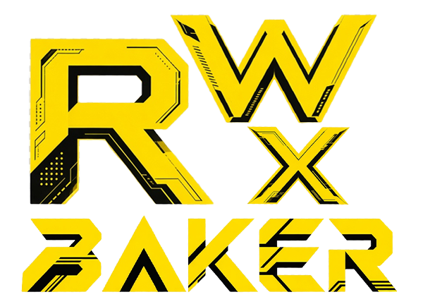
  
</p>

## Table of Contents

- [Features](#features)
- [Want to run it locally?](#want-to-run-it-locally)
- [Repository Structure](#repository-structure)
- [Customization & Theming](#customization--theming)
- [Contributing](#contributing)
- [Disclaimer & Intellectual Property](#disclaimer--intellectual-property)

## Features

- **Faithful Design:** *Meticulously* replicated UI styling, speech bubbles (9-slice scalable), custom fonts (*HarmonyOS Sans* & *Bender*), and very similar visual accents.<br>*I'm not touching CSS for a long time. I'm losing my mind...*
- **Complete Character List:**
  - 33 Playable Operators (Perlica, Chen Qianyu, Wulfgard, Ember, Yvonne, etc.)<br>
  - 30 Game NPCs (Eliza, Dannier, Alexander, Fiona, etc.)<br><br>
  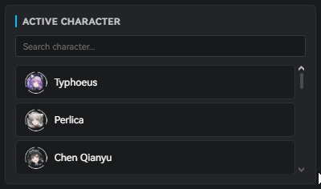<br>
  - Endmin (Female & Male) identity toggles.<br><br>
  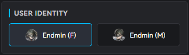<br><br>
- **Stickers & Emojis:**
  - Full collection of **168 game stickers** with searchable/grid picker (excluding skland stickers).
  - **38 game emojis** for in-text embedding and message reactions.<br><br>
  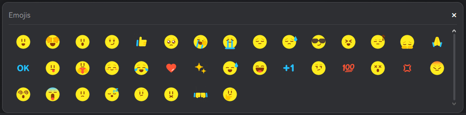<br>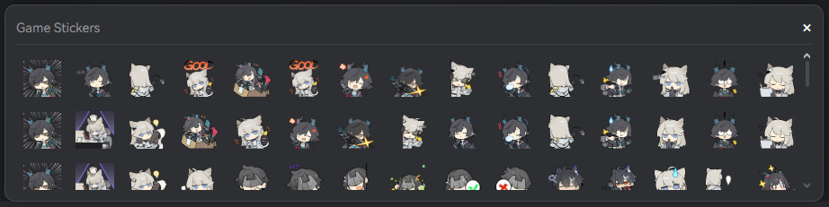<br>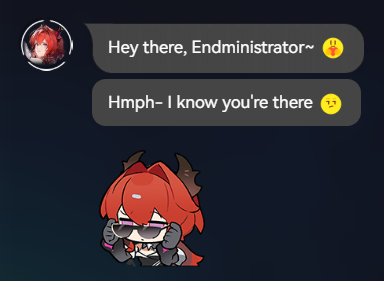<br>

- **Single & Group Conversations:**
  - Toggle between 1-on-1 chats and multi-character group channels.
  - Custom group titles and dynamic speaker switching.<br><br>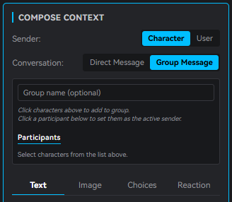<br>
  - Group chat example:<br><br>
  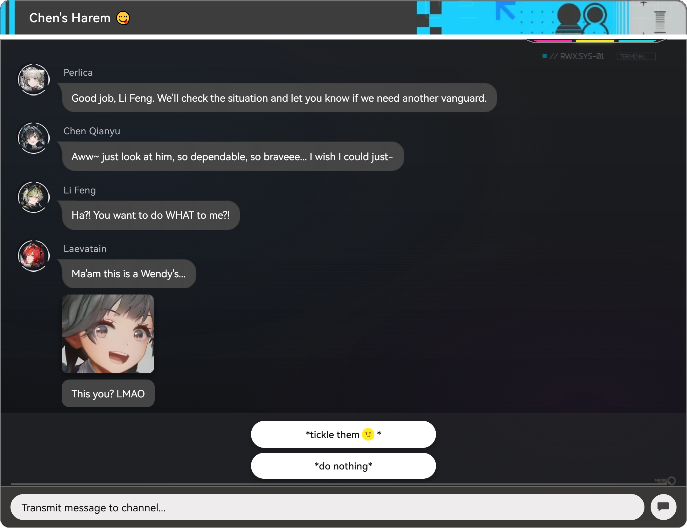
- **Interactive Dialogue Composer** *(Skuqre take notes)*:
  - Standard speech bubbles for incoming & outgoing.
  - Image bubbles, yes you can send images with **real-time drag resizing**.<br><br>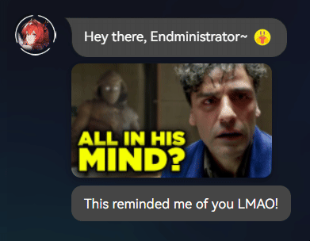<br>
  - Dialogue choices, you can add 1 or 2 choices like the in-game version.<br>Clicking on it will send it as a message/reply.<br><br>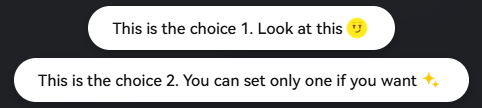<br>
  - Emoji reactions attached to individual messages.<br>Yes you can react to messages just like in-game version of the app.<br><br>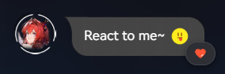<br>
  - Quick inline editing (click any message or layer to modify text or sender).<br>Compose Context mode automatically switches to Edit Mode when a message is selected.<br><br>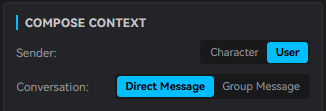
- **Drag-and-Drop Reordering:**
  - Reorder messages directly in the conversation viewport, click and hold the message bubble and move around,<br>Or via the **Conversation Layers** panel on bottom left, click and move the selected message.<br><br>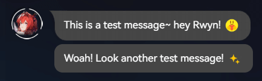
- **High-Resolution PNG Export:**
  - **Screen Mode:** Captures the current visible frame. Set as default, captures the render on the screen at that moment.
  - **Full Chat Mode:** Stitches the entire conversation from start to finish into a single continuous image.<br>Not recommended for very long conversations. For those try Multi-Page mode instead. 
  - **Multi-Page Mode:** Automatically segments long conversations into sequential slides (`RWX-Baker-1.png`, `RWX-Baker-2.png`, etc.) with continuity overlap for social media carousels.
  - **Anti-Leak Telemetry Stamp:** Exports automatically include a subtle Endfield OS telemetry stamp (`// RWX.SYS-01` or `RWX // BKR ■ 01`) dynamically rendered during capture to verify fan/community origin.<br><br>Click on the HINTS button see more tips about these export options.<br><br>
  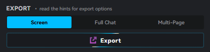
- **Dual Viewports & Terminal Mode:**
  - **Tablet & Phone Viewports:** Switch seamlessly between standard **Tablet** (default in-game aspect ratio) and compact **Phone** mode.
  - **Full Terminal Mode [**`terminal.html`**](https://baker.rwyn.ch/terminal.html):** Full-screen *re-imagination* of the in-game Baker screen/terminal interface:
    - **Channels Sidebar (460px):** Multi-channel session list supporting both direct 1-on-1 links and multi-operator group chats.
    - **Independent Save / Load JSON Backups:** Export and import multi-channel terminal setups with drag-and-drop JSON file support, complete with cross-mode safeguards (prevents accidental imports between Tablet and Terminal JSON formats).
    - **Full Terminal PNG Export:** Dedicated **Screen** and **Full Terminal** capture options rendering the complete Channels list and active dialogue window at crisp 2x resolution with zero capture darkening.<br>
    - Accessible directly via the Editor drawer on top or at [**`terminal.html`**](https://baker.rwyn.ch/terminal.html).<br>
    
    **Example LIVE and exported render versions:**<br>
<p align="center" style="display: flex; justify-content: center; align-items: center; gap: 10px;">
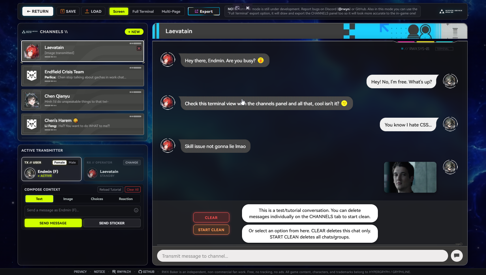
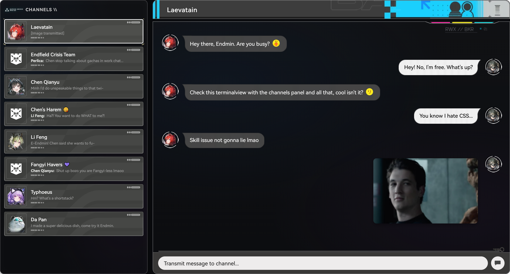<br>
</p><br>

- **100% Private & Client-Side:** No sign-ups, no cookies, no advertising, and no analytics. Every keystroke, every word and any image export is processed strictly within your local browser.

- **Map Decorations (Archived):**
  - Topographic map isoline decorations have been archived from the default toolbar toggle in favor of the new frosted glass backdrop filters (`backdrop-filter: blur()`), it was either this or map deco, and honestly this looks pretty neat so map deco goes to archive. All used CSS variables, assets, and JS handlers remain fully preserved in the code for custom forks and user styling (see the **[customization guide](CUSTOMIZATION.md)**).

---

## Want to run it locally?

RWX Baker has **zero build dependencies**, it runs directly out of the box using vanilla HTML, CSS, and JS.<br>I wanted it to be this way from the start. Anyone can easily run it.

**NOTE:** If you want to make adjustments for the actual LIVE version, dont hardcode values<br> in html or js because everything in css file is tuned for easy pixel-perfect adjustments.

1. **Clone the repository:**
   ```bash
   git clone https://github.com/rwynx/RWX-Baker.git
   cd RWX-Baker
   ```

2. **Serve the directory:**
   Use any lightweight local HTTP server to avoid CORS restrictions:

   *Python:*
   ```bash
   python -m http.server 8000
   ```

   *Node.js:*
   ```bash
   npx serve .
   ```

   Or use the VS Code Live Server extension I guess.

3. **Open in your browser:**
   ```
   http://localhost:8000
   ```

---

## Repository Structure

```
├── index.html                           # main editor
├── terminal.html                        # in-game fullscreen Baker terminal mode (WIP)
├── watermark-styles.html                # interactive watermark lab & code generator
├── CUSTOMIZATION.md                     # CSS variables, offsets & styling guide
├── privacy.html                         
├── notice.html                          
├── LICENSE                              
├── showcase                             # example screenshots
├── rwxbaker-css/
│   ├── style.css                        # complete studio & preview styling
│   └── terminal.css                     # terminal mode & full in-game baker UI layout styling (still in beta)
├── rwxbaker-js/
│   ├── app.js                           # app core logic & state
│   ├── terminal.js                      # terminal mode logic
│   ├── characters.js                    # shared operator & NPC database
│   └── dom-to-image-more.min.js         # client-side image rendering engine
└── rwxbaker-assets/                     # only used bundle (~8.9 MB)
    ├── avatars/                         # operator & NPC portraits
    ├── deco/                            # chat bubble skins & frame graphics
    ├── emoji/                           # game emojis
    ├── fonts/                           # harmonyOS sans & bender web fonts
    ├── icons/                           # UI action icons
    ├── stickers/                        # 168 game stickers (excluding skland stickers)
    ├── ui/                              # site assets/backgrounds etc.
    └── watermarks/                      # 4 sci-fi OS export watermark stamps
```

---

## Customization & Theming

Want to do some lazy edits/tweaks to layout? Adjust chat dimensions, or skin the UI? I took my damn time and put everything together, all sizing and offset parameters are *cleanly* exposed via native CSS variables. You can check this **[customization guide](CUSTOMIZATION.md)** for details on stuff like:
- Adjusting device frames like left (editor) and right (message) panel sizes, locations (tablet vs. phone aspect ratios)
- Bubble alignments, avatars, and media offsets (stickers, images etc.)
- Header asset controls, move the chat header assets around (especially phone view asset pos needs help)
- Topographic map decoration controls and opacity
- Export watermark stamp styles, positions, and live tuning workbench (**[LIVE • Watermark Styles](https://baker.rwyn.ch/watermark-styles.html)**)
- Glow effects, animated button borders, and color themes
- Terminal mode canvas sizing, channel column widths, and notch variables in `terminal.css`.
- And some other stuff

---

## Contributing

Contributions are welcomed. If you'd like to help:
- Adding newly released characters, NPCs, or stickers as the game updates,
- Reporting UI rendering bugs or recommending workflow,
- Submitting localization or accessibility improvements,

Feel free to open an **issue** or submit a **pull request**.

**NOTE:** If you want to make adjustments for the actual LIVE version, dont hardcode values<br> in html or js because everything in css file is tuned for easy pixel-perfect adjustments.

---

## Disclaimer & Intellectual Property

First and foremost, GLORY TO HYPERGRYPH!

- **RWX Baker** is an independent, non-commercial fan creation developed for creative entertainment and community storytelling purposes under fair fan-use principles.
- No ads, no trackers, no logins, no analytics, no donations, nothing.<br>**RWX Baker is fully FREE and will always be this way.**
- *Arknights: Endfield*, the "Baker" communication system (instant messaging app), character names, designs, lore, and related trademarks are the sole and exclusive intellectual property of **HYPERGRYPH Co., Ltd.** and **GRYPHLINE Pte. Ltd.**
- This project is **not** affiliated with, endorsed by, or sponsored by HYPERGRYPH or GRYPHLINE.
- Source code is licensed under the [MIT License](LICENSE). Third-party game intellectual property remains with their respective copyright holders.

For details, see [NOTICE](notice.html) and [PRIVACY](privacy.html).
